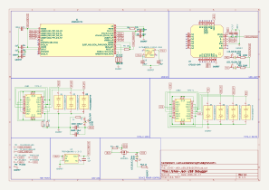

# Lichee-Jack USB Debugger

This sub-directory contains the **USB 2.0 hub + UART converter board** designed specifically for the **Lichee-Jack** project.
It is intended to simplify development, debugging, and flashing by combining **USB OTG**, **UART console**, and **power control** into a single compact board.

---

## Overview

The **LicheeRV Nano** features a **USB 2.0 Type‑C OTG port implemented directly by the SoC PHY**.
This design is slightly different from a typical USB 2.0 Type‑C implementation:

* **SUB1 / SUB2** pins are internally multiplexed as **SoC UART0**

  * Used for early boot logs, kernel `printk`, and Linux login console
* **D+ / D‑** pins are used as a standard **USB OTG interface**

  * Used for USB gadget mode (RNDIS, ECM, HID, Mass Storage, etc.)

Because UART and USB share the same physical Type‑C connector, direct connection to a PC is inconvenient during development.

To solve this, the **Lichee-Jack USB Debugger** acts as a **2‑port Type‑C converter**:

* **Port 1 (Upstream)** → Connects to the host PC
* **Port 2 (Downstream)** → Connects to the Lichee‑Jack device

The board cleanly separates:

* USB OTG data path
* UART debug console
* Power and connection detection

---

## Architecture & Design

### USB Hub

The board uses a **Microchip USB2422/MJ** USB 2.0 hub controller:

* **1 upstream port** (PC)
* **2 downstream ports**

  * One for Lichee‑Jack USB OTG
  * One internally connected to the USB‑UART bridge

This allows the Lichee‑Jack USB gadget functions to work normally **while UART is simultaneously available** on the same PC connection.

### USB‑UART Bridge

UART is provided by **CP2102‑GMR**:

* Connected to Lichee‑Jack **UART0 (SUB1 / SUB2)**
* Exposes a standard USB CDC‑ACM serial device on the host
* Suitable for:

  * U‑Boot console
  * Linux kernel logs
  * Root login shell

### Type‑C CC & Power Control

The debugger board implements **CC‑based power detection and control**:

* **PMOS power switch** controlled by CC logic
* Behavior:

  * If **Lichee‑Jack is not connected**, PMOS remains **OFF**
  * When Lichee‑Jack is connected:

    * CC pins are pulled down by the device
    * PMOS gate is driven
    * Power path is enabled automatically

This prevents:

* Back‑powering
* Floating VBUS issues
* Accidental short or unstable power states

---

## Features

* USB 2.0 Hub (1‑up / 2‑down)
* Integrated USB‑UART console
* Native support for LicheeRV Nano Type‑C pin multiplexing
* Automatic CC‑based power switching
* Works seamlessly with USB gadget modes
* No firmware required (fully hardware‑driven)

---

## Assembly

* **PCB**: 2‑layer board, thickness 1.6 mm
* **Assembly side**: Top side only
* **Solder paste**:

  * Sn63 / Pb37 **or**
  * SAC305
* Recommended to use **high‑temperature reflow profile** for hub QFN package

---

## PCBA

* All components placed on **top layer only**
* Suitable for low‑cost SMT assembly

The following files are provided in the **EXT‑Board** latest release:

* BOM (Bill of Materials)
* CPL / Pick‑and‑Place
* Gerber files

---

## Notes

* **Strongly recommended cable selection**
  Use a **Thunderbolt / USB4 Type‑C cable** to connect **Lichee‑Jack ↔ USB Debugger**.

  Some **USB 3.x Type‑C cables are USB‑3‑only** and **do not include all USB‑2 / SBU related wires**.
  In such cases:

  * USB 3.x SuperSpeed lanes may be present
  * **SUB1 / SUB2 (UART0)** lines may be **missing or not connected**

  This can result in **no UART console** even when the hardware is correct.

  Thunderbolt / USB4 cables are required by specification to include **full USB‑2 wiring**, ensuring:

  * Reliable SUB1 / SUB2 connectivity
  * Stable UART console operation

* **No UART console output/input?**
  If the serial console shows no activity, **flip the Lichee‑Jack side Type‑C connector orientation**.

  The reason is that **SUB1 / SUB2 pins are *not symmetric*** like USB D+ / D-:

  * USB **D+ / D-** support dual-side (flip) orientation
  * **SUB1 / SUB2 (UART0)** do **not** support automatic orientation switching

  Depending on plug orientation, the UART pins may not be electrically connected.
  Simply unplug and **reverse the Type-C connector on the Lichee-Jack side** to restore UART functionality.

* Designed specifically for **Lichee-Jack / LicheeRV Nano** Type-C behavior

* Not intended as a generic USB-C hub

* Recommended for development, debugging, and factory flashing workflows

