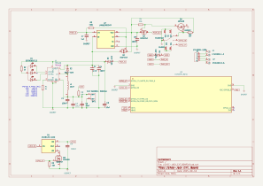
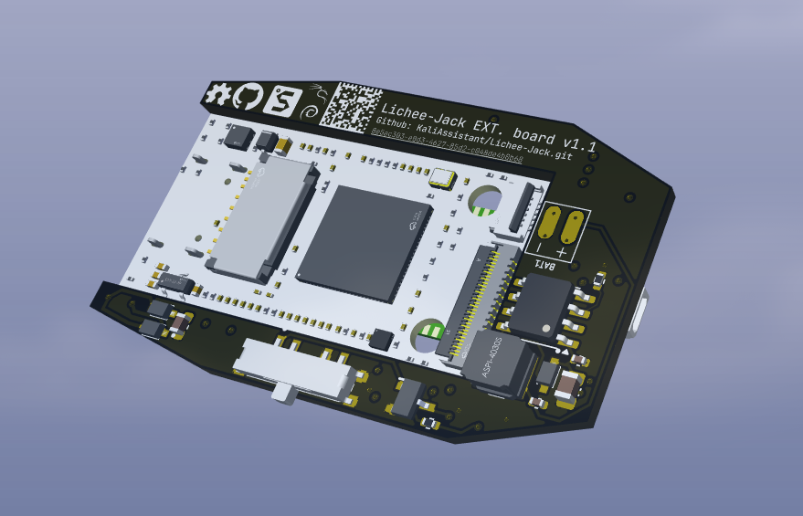
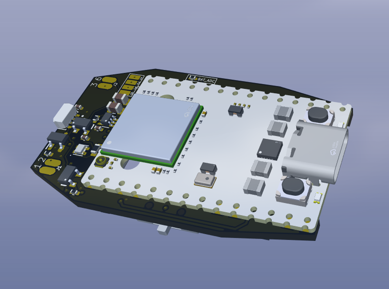
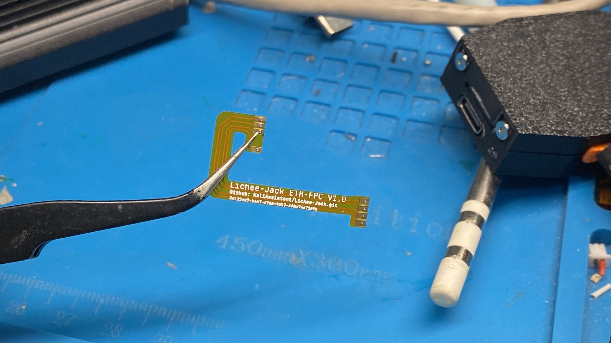
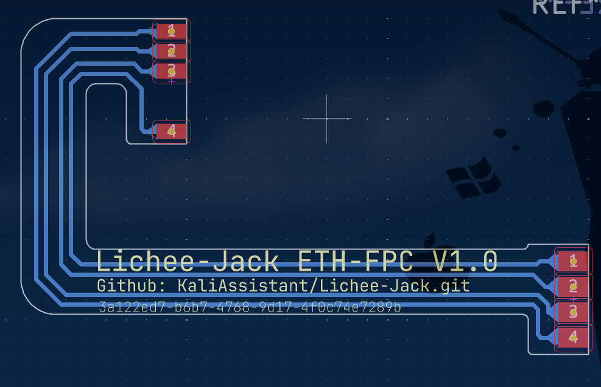

# Lichee-Jack-pcb

This repository contains the open-source extension board design for the [Lichee-Jack](https://github.com/KaliAssistant/Lichee-Jack) project.

## Overview

The extension board consists of two main parts:

### 1. `Lichee-Jack_EXT_BOARD`

* The main functional PCB
* PCB thickness: 1.6 mm
* Includes core components such as:
  * Battery management circuit
  * WS2812 (NeoPixel) LED
  * SP3T switch
  * Other supporting components

### 2. `Lichee-Jack_ETH_FPC`

* A flexible flat cable (FPC) used to connect:
  * The Ethernet (ETH) pads on the LicheeRV Nano
  * The corresponding ETH pads on the extension board

---

## Assembly Notes

> [!NOTE]
> Soldering requires **careful thermal profiling** to avoid damaging components.

### EXT. Board

- Use **high-temperature solder paste** (e.g., `Sn63/Pb37` or `SAC305`)

###  ETH-FPC

- Solder using a **standard soldering iron**

### LicheeRV Nano + EXT. Board

- Use **low-temperature solder paste** (e.g., `Sn42/Bi58`) when soldering these together

 

---

## Battery Information

- **Recommended:** Li-po 3.7V 200mAh battery  
- **Model:** `402030`  
- Specifically chosen to **fit inside the 3D-printed case** included in this repository

---

## 5V Power Configuration

On the **LicheeRV Nano**, the **USB 5V input (VBUS)** and **VSYS** are shorted by a `0Ω` resistor (labeled `"5V"`) on the **bottom layer**.

> [!NOTE]
> **To safely power the system externally**, you must **remove this 0Ω resistor.**

---

## Compatibility with 3D-Printed Case

To fit the **LicheeRV Nano + Extension Board** into the provided **3D-printed enclosure**, perform the following hardware modifications:

### 1. Remove Components

- Desolder the **CSI Camera connector** from the LicheeRV Nano

### 2. Ethernet Cable Wiring

- Cut and strip a short **4P (or 8P)** RJ45 cable (you only need the wires)
- Solder the following wires to the Extension Board ETH pad:
  - `WOG`, `OG`, `WG`, `G` -> `1` `2` `3` `6`
- Crimp an **RJ45 8P8C** connector to the other end

---

## PCB Assembly (if SMT soldering is hard)

If you or your assembler are not comfortable with SMT soldering, you can have the extension board fabricated and partially assembled by a PCB/PCBA manufacturer (for example: JLCPCB, PCBWay, Seeed Fusion, etc.). Use the repository release files (Gerbers) together with the **BOM** and **CPL** to place an order for PCB fabrication and PCBA (assembly) of the **Extension Board only**.

**Important:** the manufacturer will only assemble the extension board (EXT_BOARD). The SIPEED LicheeRV Nano module itself is **not** included in the PCBA service — you must solder the LicheeRV Nano to the EXT_BOARD yourself after receiving the assembled PCBs, unless you explicitly arrange a custom assembly that includes the Nano (rare and often expensive).

If you want a fully populated, plug-and-play unit, contact the PCBA vendor beforehand and confirm which parts they will source and assemble (and whether they can handle the LicheeRV Nano module). Otherwise expect to receive the EXT_BOARD fully assembled and still needing the LicheeRV Nano and a few user-installed parts.

---

## PCB Versions

The PCB design has 2 versions — always use the newest version (now **v1.1**).

### Changelog

* **v1.0 → v1.1**

  * **Issues in v1.0:**

    * The `$PWRIN` → `$PWROUT` path did **not** include a Schottky diode. If USB power is removed while the boost converter is supplying 5V, the boost output could back-charge the TP5400 battery charger.
    * The SP3T **pos1** signal in v1.0 was wired to **GPIO-A16** (UART0-TX). During early boot (BL2) of the LicheeRV Nano this prevented serial output and could cause the board to hang or fail to boot. In **v1.1** the pos1 line was moved to **GPIO-A15**.
    

---

## License

Licensed under **GNU GPLv3**.
Feel free to **use**, **study**, **modify**, and **share** under the same license.
